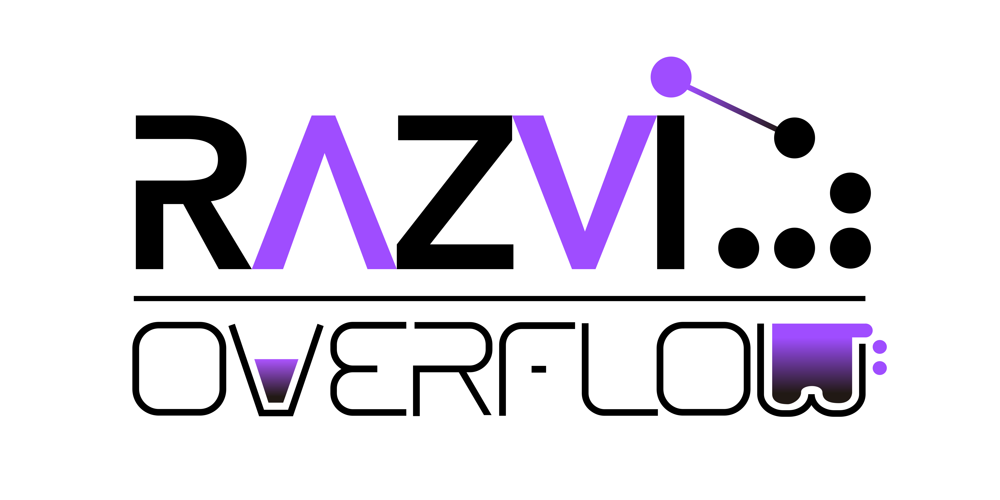

# Exploit code, not people.

	

	

	

	<a href="http://phrack.org/issues/7/3.html"><i>My crime is that of curiosity</i></a>

  <h3><b>Reach me out on</b></h3>

	 &nbsp;&nbsp;
	 &nbsp;&nbsp;
	 &nbsp;&nbsp;

<!--
**RazviOverflow/RazviOverflow** is a ✨ _special_ ✨ repository because its `README.md` (this file) appears on your GitHub profile.

Here are some ideas to get you started:

- 🔭 I’m currently working on ...
- 🌱 I’m currently learning ...
- 👯 I’m looking to collaborate on ...
- 🤔 I’m looking for help with ...
- 💬 Ask me about ...
- 📫 How to reach me: ...
- 😄 Pronouns: ...
- ⚡ Fun fact: ...
-->
